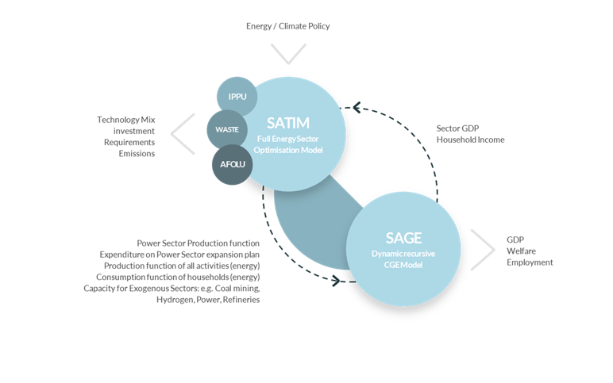

# 2. SATIM Model Structure 

The South African TIMES Model (SATIM) is described as a **full sector, national energy system optimization model**. It aims to address the planning problem of meeting projected future energy demand by considering the least-cost energy mix and investment plan over a specific planning horizon. SATIM utilizes a **linear optimization algorithm** to derive the technology and fuel mix that will minimize the total discounted system costs over the planning horizon, subject to imposed constraints,such as CO2 emission limits, reliability constraint limits, and operational limits, among others.

 ## 2.1. General Model Structure 

*Simple Schematic of the South Africa Times Model.*

Within SATIM, there are three supply sectors **(electricity and liquid fuels)** and five demand sectors **(industry, agriculture, residential, commercial, and transport)**.

 Each sector undergoes further disaggregation into appropriate subsectors. This detailed representation of both supply and demand sectors explicitly captures the impact of structural changes in the economy, such as varying sector growth rates, process modifications, fuel and mode switching, and advancements in technology and efficiency gains. SATIM governs each demand sector through a set of parameters and general assumptions. These include considerations for the sector's structure and energy service needs, the base-year demand for energy by fuel type, technical and cost parameters of available technologies, and the forecasted demand for energy services over the planning horizon.

 ## 2.2 Sets

Sets are responsible for defining the structure of the model (i.e., temporal space, geographic space, elements of the system etc.) In SATIM, the groups of sets include: years, fuels, technologies, emissions and modes of operation. These sets are characterised by parameters that are further explained below.

### 2.2.1 Year
The model planning horizon spans from **2012 (the base year) to 2050** . The base year replicates South Africa’s energy system in **2012** and **2017**. Data in the past is set according to historical information.

### 2.2.2 Fuels 
*Table 2.1: Summary of fuels included in the SATIM model*

### 2.2.3 Technologies 
*Table 2.2 Summary of technologies included in SATIM energy model.*

### 2.2.4 Emissions 
*Table 2.3 Summary of emissions included in SATIM*

| Abbreviations  | Description             |
| ---------------| ------------------------|
| NOX            | Nitrogen Oxides         |
| SOX            | Sulphur Oxides          |
| CO2            | Carbon Dioxides         |
| CH4            | Methane                 |
| CO             | Carbon Monoxide         | 
| NMVOC’s        | Non-methane volatile organic compounds|
| PM10           | Particulate Matter (10 microns or less) |

### 2.2.5 Mode of operation
The model has 1 mode of operation, for representing the normal operation of the system.

### 2.2.6 Region
The model has a nationwide scope, therefore it only has **one** region: South Africa.

## 2.3 Energy Supply Disaggregation 

The energy supply in SATIM is disaggregated into various components to comprehensively capture the complexities of the South African energy system. The disaggregation includes the extraction of primary resources, production of electricity and liquid fuels, as well as imports of electricity, oil, and other liquid fuels products. Coal exports, electricity exports, and overproduction of liquid fuels are also considered within the energy supply sector.

In the power sector, the representation encompasses the generation, transmission, and distribution components, with a detailed modeling of operating power plants, including their decommissioning schedule, planned new builds, retrofits, and technology characteristics such as efficiency and capacity factors. The individual representation of power plants allows for the incorporation of expected decommissioning schedules, planned retrofits, and technology characteristics, providing a detailed view of the power sector within SATIM.

**[Electricity Supply Sector]{.underline}**

**[Model Structure]{.underline}**

The power sector is split into Generation, Transmission and
Distribution. In SATIM, the Generation component is modelled in the most detail. Since the country
is modelled as a single node, transmission is modelled as a single technology linking
centralised/high voltage electricity (ELCC) to medium voltage levels (ELC). The medium voltage
electricity is distributed to each sector using a different technology to capture the
different losses incurred in the different sectors. This is depicted in the figure 1 below. Note
that for purposes of simplicity, the supply technologies and sector distribution legs have
been shown in aggregate form.

{width="6.5in"
height="2.948695319335083in"}

*Figure 1: Simple Schematic of the Electricity Supply Sector in SATIM.*

Technologies such as pumped storage are modeled as consuming power from
the transmission system and feeding output back into the system;
cogeneration options are modeled after transmission and feed power back
onto the grid at that point (industrial electricity demand), and also
generate heat which contributes to the industrial heat demand. Aggregate
losses are modeled for transmission and distribution. The model is a
one-region model and so there is no impact on results from shifting
generation from current locations to more dispersed locations (for
instance as a result of developing a significant amount of renewable
energy capacity). The structure and assumptions underlying the
transmission, distribution and generation components of SATIM are
briefly discussed below.

## **[Transmission]{.underline}**

Transmission capacity is modeled as a single technology linking
centralised/high voltage electricity (ELCC) to medium voltage (MV)
electricity lines (ELC). Note that for purposes of simplicity, the
supply technologies and sector distribution legs are aggregated in
**Figure 1**.

+-----------------------------------------------------------------------+
| **Assumptions Electricity Transmission**                              |
+=======================================================================+
| Transmission of electricity between ELCC and the MV distribution      |
| network incurs a loss of **3.9%.**                                    |
+-----------------------------------------------------------------------+
| MV electricity is distributed to each sector in a way that captures   |
| the different levels of losses that are incurred distributing         |
| electricity to the sector. For example,the distribution of            |
| electricity to residential households is assumed to incur a loss of   |
| 19.7% whereas the distribution of electricity to the industrial       |
| sectors (excluding mining) incurs a smaller average loss of **6.%.**  |
+-----------------------------------------------------------------------+
| An existing stock/capacity for the transmission technology is         |
| estimated based on the peak                                           |
|                                                                       |
| demand in the base year plus a reserve margin. For the base year of   |
| 2006, this is currently                                               |
|                                                                       |
| estimated as **31.8 GW.**                                             |
+-----------------------------------------------------------------------+
| The operating cost of is set to reflect the estimated running cost of |
| this                                                                  |
|                                                                       |
| Infrastructure. Currently estimated as **287.91 R/kW.**               |
+-----------------------------------------------------------------------+
| The investment cost of new transmission capacity is set to reflect    |
| estimated                                                             |
|                                                                       |
| average cost of investment. Currently estimated at **6329.31 R/kW**   |
+-----------------------------------------------------------------------+
| A reserve constraint is imposed on ELC to ensure the reserve is       |
| maintained.                                                           |
+-----------------------------------------------------------------------+

## **[Distribution]{.underline}**

The legs of the distribution system supplying each sector are modeled as
technologies as follows:

Distribution Technologies in SATIM Distribution Leg Technology Code in
SATIM :

Electricity to Agriculture --- &rarr AGRELC

Electricity to Commerce --- &rarr COMELC

Electricity to Industry --- &rarr INDELC

Electricity to Residential --- &rarr RESELC

Electricity to Transport --- &rarr TRNELC

Electricity to Upstream (Refineries)--- &rarr UPSELC

  -----------------------------------------------------------------------
  **Assumptions Electricity Distribution**
  -----------------------------------------------------------------------
  The distribution technologies capture the average losses incurred by
  each sector. Currently all sectors are modelled to experience
  electricity supply at national average distribution losses (10%). Large
  industries may however have their own proximate substation supplied at
  the very highest distribution voltage so losses would be lower than is
  currently modelled in SATIM. This is in the process of being amended.

  The capacity is set according to the peak demand in each sector plus
  the reserve margin.

  A reserve constraint is imposed on each distribution technology to
  ensure the reserve is maintained.

  The operating cost of the distribution technology is set to reflect the
  average tariff seen by each sector.

  The investment cost of new distribution capacity is set to reflect
  average cost of investment.
  -----------------------------------------------------------------------

Since South Africa is modeled as a single node in SATIM,transmission and
distribution losses are applied as aggregate losses in the model. Under
this configuration, shifting generation from current location to more
dispersed location does not impact results for instance as a result of
developing a significant amount of renewable energy capacity.

## **[Generation]{.underline}**

Technologies and Commodities represented in the model are described in
**Annex A1+2.** The structure and assumptions used to model existing and
future generation technologies are dealt with in greater detail below.

### **[Parameterization of Existing Power Plants]{.underline}**

The technologies in the demand-side sectors of SATIM are quite uniform
in an abstract sense, being defined by a limited number of parameters
such as efficiency, demand share and cost. The supply-side technologies
are necessarily more complex and a great many parameters exist in TIMES
that can be used to profile them and introduce constraints into the
model. Thus it makes sense to explore the methodology for this sector by
detailing the parameterization of 85 technologies. Existing power plant
technologies are modelled in a similar way and all have the following
basic parameterization. CHP plants and Pumped Storage plants have
additional parameters in SATIM which are discussed separately below. The
basic parameters input to the model are listed below.

+-----------------+--------------------------------------+------------+
| **Parameter**   | **Description**                      | **Data +   |
|                 |                                      | Sources**  |
+=================+======================================+============+
| **Energy Input  | Fuel is coal, diesel and other fuels | Annex A1   |
| Commodity or    |                                      |            |
| Fuel**          |                                      |            |
+-----------------+--------------------------------------+------------+
| **Output        | In this case is centralized          |            |
| Commodity**     | electricity (ELCC).                  |            |
+-----------------+--------------------------------------+------------+
| **Efficiency**  | relates the energy input commodities | Annex A3   |
|                 | to the sum of energy output          |            |
|                 | commodities.                         |            |
+-----------------+--------------------------------------+------------+
| **Fixed and     | Relates to yearly cost to run power  | Annex A3   |
| Variable        | technologies. Excludes fuel costs    |            |
| operating and   | except in the case of the Koeberg    |            |
| maintenance     | nuclear plant.                       |            |
| cost**          |                                      |            |
+-----------------+--------------------------------------+------------+
| **Overnight     |                                      | Annex A3   |
| Investment      |                                      |            |
| Cost**          |                                      |            |
+-----------------+--------------------------------------+------------+
| **Annual        |                                      | Annex A3   |
| Availability**  |                                      |            |
+-----------------+--------------------------------------+------------+
| **Refurbishment | specifies the capacity that is       | Annex A3   |
| retirement      | initially available and how that     |            |
| profile**       | increases in the case of             |            |
|                 | refurbishments and decreases as      |            |
|                 | plants or parts of plants retire in  |            |
|                 | the future. The assumed profiles for |            |
|                 | Eskom plant are described below.     |            |
+-----------------+--------------------------------------+------------+
| **Lifetime**    |                                      |            |
+-----------------+--------------------------------------+------------+

[Refurbishment/retirement profile:]{.underline}

{width="4.645833333333333in"
height="2.1875in"}

*Figure 2. Eskom decommissioning and retrofitting schedule*

Operating power plants are represented individually and the power sector
in SATIM therefore includes the expected decommissioning schedule of
coal fired power plants,all planned new builds, planned retrofits as
well as plant technology characteristics (efficiency, capacity factors
etc). The expected decommissioning schedule of the existing coal fleet,
air quality plant retrofit schedules for fabric filter plants (FFP) and
low NOx burners (LNB) are assumed to follow the ESKOM decommissioning
schedule represented in Table X,although it is possible to run scenarios
with endogenous retirement of existing and new coal power plants. Flue
gas desulfurization (FGD) retrofits are not accounted for. Medupi and
Kusile are decommissioned after 2050 which falls outside of the planning
window.

[Additional Parameterization for Combined Heat & Power (CHP)
Plants]{.underline}

  -----------------------------------------------------------------------
  **Parameter**          **Description**
  ---------------------- ------------------------------------------------
  **Industrial Process   CHP's are modelled as producing a second output
  Heat \[IPPS\]**        commodity, Industrial Process Heat \[IPPS\]
                         pertaining to the sub-sector (eg. Iron & Steel)
                         in which the CHP is found.

  **Operating in         In back pressure mode you cannot bypass the heat
  back-pressure, with a  load so the electricity to heat ratio is
  constant Electricity   constant. Alternatively in 'Condensing' mode,
  to Heat output ratio   the electricity to heat ratio is determined
  \[NCAP_CHPR\].**       endogenously which requires a number of
                         additional parameters and is appropriate when
                         CHP has a large share of the system which is not
                         the case in SATIM.

  **Additional input     Some CHP's are given the option to use an
  fuel**                 alternate fuel (e.g. biomass and coal). The
                         share of biomass/coal is fixed based on
                         estimates of historical consumption.
  -----------------------------------------------------------------------

[Additional Parameterization for Existing Pump Storage
Systems]{.underline}

{width="6.5in"
height="1.2294214785651794in"}

*Figure 3. Schematic of Pump Storage System Representation in SATIM*

+----------------------+-----------------------------------------------+
| **Parameter**        | **Description**                               |
+======================+===============================================+
| **Night**            | In TIMES you need to declare storage          |
|                      | technologies as such and the **storage dam**  |
| **storage technology |                                               |
| \[NST\]**            | **technology** is allocated as a member of    |
|                      | the set \[NST\] which signifies it as a       |
|                      | **night**                                     |
|                      |                                               |
|                      | **storage technology.**                       |
+----------------------+-----------------------------------------------+
| **Parameter          | The cycle efficiency of the system is         |
| Attribution**        | attributed to the pump technology. The        |
|                      | capacity and cost parameters are attributed   |
|                      | to the turbine.                               |
+----------------------+-----------------------------------------------+
| **Input + Output     | The **input commodity** is electricity        |
| commodity**          | downstream of transmission **(ELC)**, and the |
|                      | output commodity is electricity upstream of   |
|                      | transmission **(ELCC).**                      |
+----------------------+-----------------------------------------------+

### [Basic Structure & Assumptions for New/Future Power Plants]{.underline}

A great many technologies are possible candidates for future supply of
electricity in the power sector. The level of detail selected here is a
trade-off between capturing as many of these possibilities and not
wasting effort on very marginal future prospects or on disaggregation
that is still not useful because the power sector is only slowly
diversifying now and trends are unclear. New power production
technologies need not only to reflect the many emerging renewable and
clean coal technologies but also all possible options for import from
neighboring regions. South Africa has, for instance, a rich solar
resource and therefore there is reasonable disaggregation of these
technologies.

+-----------------------------------------------------------------------+
| **Additional Assumptions for New Power Plants:**                      |
+=======================================================================+
| There is no initial capacity or retirement profile for new            |
| technologies but **future capacity**                                  |
|                                                                       |
| is bounded by a capacity limit parameter.                             |
+-----------------------------------------------------------------------+
| An investment cost is specified. Renewable technologies have          |
| **investment costs** that                                             |
|                                                                       |
| decrease over time to capture the effect of learning from global      |
| installed capacity (note                                              |
|                                                                       |
| that in this model this parameter is set exogenously).                |
+-----------------------------------------------------------------------+
| A **technology lead-time** is specified to capture the construction   |
| duration.                                                             |
+-----------------------------------------------------------------------+
| In the case of committed build, a **lower bound is imposed on the new |
| capacity** as per                                                     |
|                                                                       |
| the build plan, taking into account the construction duration.        |
+-----------------------------------------------------------------------+
| Some technologies have a **lower bound on the load factor** (also     |
| called capacity factor)                                               |
|                                                                       |
| to characterize fuel contracts. This is defined by setting up an      |
| inequality relationship                                               |
|                                                                       |
| between special algebraic parameters rather than the                  |
| parameter-value/s pair method of                                      |
|                                                                       |
| most other parameterisation in TIMES. This means that the plants must |
| generate a                                                            |
|                                                                       |
| minimum of electricity to attain this capacity factor. Currently in   |
| SATIM this only applies to                                            |
|                                                                       |
| gas-fuelled gas turbine plant which must maintain a load factor in    |
| excess of 20% in terms                                                |
|                                                                       |
| of fuel supply contracts.                                             |
+-----------------------------------------------------------------------+
| As discussed above, SATIM has **two wind classes,** with capacity     |
| factors of 29% and 25%,to reflect the varying quality of sites. Each  |
| wind class is bounded by the potential for deployment in each class,  |
| that is, the minimum or maximum limit on capacity built specifically  |
| in that year. Currently in SATIM this is only used to reflect         |
| historical build of the                                               |
|                                                                       |
| high resource wind class as follows:                                  |
|                                                                       |
| o 2009 - 0.2 GW                                                       |
|                                                                       |
| o 2010 - 0.3 GW                                                       |
|                                                                       |
| o 2011 - 0.3 GW                                                       |
+-----------------------------------------------------------------------+
| The **intermittency of wind** is captured by setting the capacity     |
| availability equal to the                                             |
|                                                                       |
| energy availability. For instance a 100 MW wind farm at 29% estimated |
| capacity factor will                                                  |
|                                                                       |
| be modelled as only being able to produce 29MW of output in any       |
| time-slice.                                                           |
+-----------------------------------------------------------------------+
| The **capacity credit** of wind is fixed at a conservative value      |
| below the capacity factor.                                            |
|                                                                       |
| Currently in SATIM the capacity credit for both wind classes is set   |
| to 0.23.                                                              |
+-----------------------------------------------------------------------+
| In SATIM, **solar PV without battery storage can only output power    |
| during daytime**                                                      |
|                                                                       |
| **hours.** This is accomplished by setting the capacity factor per    |
| time slice. Timeslices not in                                         |
|                                                                       |
| daylight are set to zero.                                             |
+-----------------------------------------------------------------------+

## 2.4 Demand Sector Disaggregation

### 2.4.1 Transport

The transport sector in SATIM is represented as a multi-time, multi-sector, bottom-up model that captures the energy demand and supply dynamics specific to South Africa. The sector includes various modes of transportation, such as road, rail, air, freight, and pipeline, as well as specific technologies for each transport type. Given that the transport sector is driven primarily by vehicle-kilometers traveled and the efficiency of travel, SATIM's representation incorporates detailed disaggregated information regarding passenger and freight transport by road, rail, pipeline, and aviation.

Additionally, the detailed representation of transport technologies in SATIM includes specific classifications like Bus Rapid Transport (BRT), Metropolitan Transport (Metro), as well as internal combustion engine and battery electric road vehicles

### 2.4.2 Industrial

The following subsectors are included in the industrial sector:

- **Mining**
- **Chemicals**
- **Food, beverages, and tobacco**
- **Precious and non-ferrous metals**
- **General manufacturing** 

These subsectors encompass a diverse range of industrial activities and energy service needs. Two different approaches are applied to model industrial energy consumption within SATIM.

 The first approach, referred to as **Methodolody 1**, is applied to subsectors such as mining, chemicals, food beverages and tobacco, precious and non-ferrous metals, and general manufacturing. This approach relies on estimates of energy service needs and their efficiency at which energy services are met.
 
  The second approach, **Methodology 2** two, is applied to specific subsectors such as Iron and Steel, Ferroalloys, Aluminium, Non-metallic minerals, and pulp and paper. In this approach, final energy demand is calculated based on the energy intensities specific to technology processes and their level of production.

### 2.4.3 Residential

The residential sector in SATIM is disaggregated based on parameters such as income levels, electrification status, and specific energy service demands pertaining to cooking, water heating, space heating, refrigeration, lighting, and other electrical services. The disaggregation reflects the diversity in energy access, the use of multiple fuels within households to provide the same energy service, fuel subsidies, and technology efficiency.

Furthermore, the representation includes high, medium, and low-income electrified households, as well as medium and low-income non-electrified households. The demand for energy services within the residential sector is governed by specific drivers such as population, household income, and electrification rate.

### 2.4.4 Commerical

The commercial sector in SATIM is represented through the inclusion of energy use by various sub-sectors such as **wholesale, retail, motor trade services, accommodation, finance, real estate, business services, and government**.

The estimation of commercial sector demand for energy services is based on several factors, including the assumed energy intensity of energy services per unit area, the growth in floor area over time, and improvements in energy efficiency due to building code regulations.

Furthermore, SATIM's representation of the commercial sector factors in **total commercial floor area**, estimated to be around 88 million square meters in 2012, with growth projections based on the correlation between changes in floor area and real GDP.

### 2.4.5 Agriculture

The agricultural sector in SATIM is represented by capturing the demand for energy services specific to this sector and is driven by sectoral GDP, reflecting the energy-intensive activities and processes involved in agriculture. The representation includes subsectors such as irrigation, heating, processing, traction, and other agricultural activities, each with distinct energy demands.

The useful energy (UE) demand, which pertains to the demand for energy services, is exogenously specified, and projections for UE demand to 2050 are calculated based on the anticipated growth of primary drivers such as population, GDP, industrial sector production, and agricultural production. These drivers have a significant impact on the energy demand within the agricultural sector.

Information on Data Inputs is avaliable [here](/docs/source/05Data%20Inputs.ipynb).

