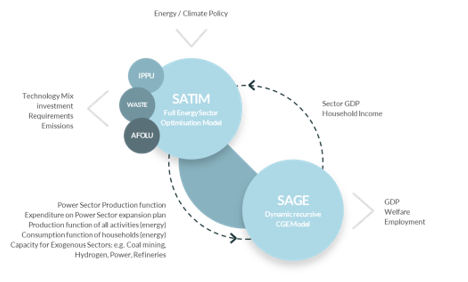

# 2 Long-term energy systems modelling – SATIMGE

The ESRG modelling framework consists primarily of two components:

- A whole-system energy model called **SATIM** (the South African TIMES model), and
- A Computable-General Equilibrium (CGE) economic model called **SAGE.**

These two models are linked together and solved iteratively, as outlined below. A more detailed description of SATIMGE will be available in forthcoming publications.

## 2.1 SATIM

**SATIM is a bottom-up energy systems optimisation model which finds _least cost energy pathways_ to meet future energy demand given various technical, environmental, and other constraints.**

SATIM is structured by disaggregating South Africa’s energy sector into:

- Energy consumption (or ‘demand’), subdivided into sectors – **residential, commercial, industrial, transport and agriculture.**
- Energy supply – electricity generation, liquid fuels refining, hydrogen production, and primary energy supply (imports/extraction).; and

Each demand sector is further disaggregated into subsectors (e.g. iron and steel, passenger transport, etc.) and eventually down to technology level (e.g. blast furnaces, private petrol sedans, etc.). Technologies are characterised with data on fuel use, cost, efficiency, emissions and other relevant parameters.

When running a scenario in SATIM, the model calculates annual projected energy demand based on macroeconomic drivers (GDP, population) and indicators (e.g. household income) and then ‘solves’ the least cost technology mix to meet that demand over the modelling horizon, accounting for any particular constraints such as emissions limits, technology availability, fuel prices, and others. SATIM’s base year is currently 2017 (i.e., initial energy demand and supply data for South Africa are based on the 2017 energy balance).

## 2.2 SAGE

**The CGE model of South Africa (SAGE) is a dynamic recursive, country level, economy wide model that simulates the functioning of the South African economy.** SAGE provides a detailed and comprehensive representation of the South African economy including:

- Up to 104 sectors and commodities
- 5 factors of production (capital and 4 labour groups)
- 12 household categories

Within each annual time slice SAGE is solved based on data and assumptions for population, productivity, and capital supply. Between periods SAGE is updated to reflect population growth, technical change, and capital accumulation. New capital formation is determined endogenously based on previous-period investment levels and the relative profit of the different sectors. Once invested, capital becomes sector specific.

Extremely long-term scenarios that involve significant deviations from baseline projections should include a significant role for technological change. SAGE has a restricted capability to make the technological change process endogenous, i.e. dependent on economic variables such as price signals, research and development, and investment while ensuring that long-term scenarios are technically viable.

## 2.3 Linked model

The energy extended version of SAGE is linked to the full energy sector South African TIMES (SATIM) model. Combining the two models captures the details required from the energy systems modelling with economic analysis to assess the impact of energy system changes on various sectors, markets, and agents in the economy.

The models are run iteratively allowing information to be exchanged in both directions:

- SATIM computes the least-cost energy technology mix based on assumptions about technology and fuel costs, as well as constraints such as demand and emissions, given an initial demand projection.
- The resulting technology mix is then passed to SAGE, which incorporates the new energy supply and demand composition. Aggregate investment in SAGE is determined by assuming a macro adjustment process, where changes in aggregate final demand are shared proportionally across consumption, investment, and government spending.
- SAGE thus provides new projections of economic indicators, which are then fed back to SATIM to update demand and for further optimisation.
- This iterative process continues until indicators such as GDP stabilizes between iterations, which results in alignment in terms of energy utilisation, CO2 emissions, demand, price, and technology mix between the two models.

A high-level schematic of the SATIMGE architecture and process is shown below in Figure 1.

 *Figure 1: SATIMGE overview*