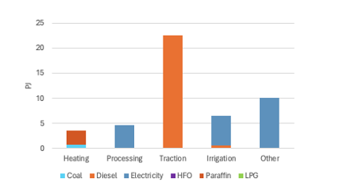

# 3 Energy demand

This section provides an overview of the major energy demand sectors of the South African economy, in terms of how they are modelled and analysed in SATIM. The five major demand sectors are:

- Residential
- Commercial
- Industry
- Transport
- Agriculture

Within each sector, energy demand is expressed bottom-up by technology or fuel grouping, with sectors disaggregated into end-uses at technology level, depending on data availability. Growth and shifts in energy demand, including fuel switching and efficiency improvements, form the key building-block for future energy projections within the IEP framework.

## 3.1 Residential buildings

**The Residential sector in SATIM is structured to capture changes in fuel and technology use and energy service demands that follow rising income levels**.

There are three income groups represented in SATIM:

- Low income, which represents 45% of the population in 2017
- Middle income (31% of the population)
- High income (24% of the population)

Each income group is further disaggregated into a demand for energy services capturing energy consumption for lighting, cooking, space heating, refrigeration and a combination of other (mostly electrical) appliances, as shown in Table 1 (which also shows the drivers of household growth, energy service demands, fuel use and appliance ownership captured in the model). Each service demand is also characterized by a particular seasonal/diurnal profile.

Table 1: Modelling structure and disaggregation for the residential sector in SATIM

| Disaggregation level | Drivers |
| --- | --- |
| Households: Low, Middle and High income groups | Population, household size, GDP |
| Energy Service Demands: Lighting, cooking, water heating, space heating and cooling, Refrigeration, Other | Household income, electrification,  Policies and regulations such as building standards  Behaviour change |
| Fuels: Wood, coal, paraffin, gas, electricity  Appliances: (televisions, washing machines, dish washers, etc). The energy intensity and efficiency of a core group of appliances is captured individually and represented as an “average” in the model under “other”. | Household income, electrification,  Policies and regulations such as fuel subsidies, appliance standards |

The classification of households into income groups and the primary fuel used by households for cooking, space heating and water heating draws primarily on the 2011 Census (StatsSA, 2011), while electrification assumptions are according to the National Development Plan (National Planning Commission, 2012).

**Households in all income groups use a variety of fuels to meet their energy service needs** and, particularly in middle and low income households, typically use more than one fuel type to meet energy services (e.g. both biomass and electricity for cooking) – a principle known as **fuel stacking**.

 *Figure 2: Final energy demand to provide energy services in low, middle and high income households in SATIM*

**Within SATIM, household energy service needs, such as lighting and cooking etc, are met by technologies such as LEDs or CFLs and electric or paraffin stoves. Technologies, and their assumed average efficiencies, are specific to the type of technology and fuel being used.** For example: an electric geyser can be used to supply hot water at 75% efficiency, whereas wood used for water heating in low income households (open fire) has an efficiency of 11%. This allows us to capture the average energy efficiency of meeting energy service needs using different fuels and technologies as well as the impact that a shift in fuel or technology use will have on the demand for energy to supply energy services. Technology efficiencies can be specific to income groups, e.g. lower income households are more likely to have old and less efficient fridges. Efficiency levels also capture shifts between electrical appliances, for example the increased penetration of LEDs for lighting, or the uptake of combined-heat-and-power (CHP) and solar water heaters (SWH) for water heating. 

**The upward mobility of households from lower to middle and higher income groups, driven by growth in GDP, will cause an increase in electricity use in favour of other alternative fuels over time,** as households increase their appliance ownership as their income grows. Increases in electricity use are however partially tempered by energy efficiency improvements in the sector, based on assumptions about efficacy of the Standards and Labelling programme and Minimum Energy Performance Standards (MEPS) for appliances (DMRE, 2022). Upward mobility of households is captured in the model by altering the share of households in each income group over time. The share of households in each income group is taken from SAGE.

**However, under current projections not all households would be able to migrate out of the lower income group by 2050.** Many of these households are currently in a state of energy poverty and may struggle to move away from the use of solid fuels without support. 

## 3.2 Commercial Buildings

The commercial buildings sector in SATIM includes wholesale, retail and motor trade services, warehouses and industrial spaces, office buildings, banking facilities, and other non-residential and government spaces including schools, hospitals, hotels, and recreational facilities. Public sector floor area, which primarily serves public services, includes public lighting and water services is also considered. 

**Commercial sector energy service demand is estimated based on the energy intensity of energy services required as a function of lettable floor area (PJ/m2)** and is linked to growth in floor area and improvements in energy efficiency over time. Final energy demand is internally computed within SATIM, factoring in technology efficiency and penetration within the sector, as the model assumes that energy services in new buildings can be delivered more efficiently with newer technologies, while constraints on residual capacity and building design limit the adoption of newer technologies and other improvements in energy efficiency in older buildings. 

**Energy services are disaggregated into cooling, space heating, cooking, lighting, refrigeration, water heating, public lighting, public water supply, and other appliances.** As with the residential sector, end-uses can be represented either by fuel or technology. Technology shares encompass the prevalence, activity levels, and efficiencies of different technology types supplying specific energy services. Figure 3 shows the final energy demand for each energy service represented in the model in 2017.

*Figure 3: Energy end-use consumption specified by fuel and generic end-use for Commerce (SATIM)*

**In the long-term, commercial buildings in South Africa will likely undergo significant transformations driven by sustainability goals, equitable urban planning initiatives and technological advancements.** Sustainable and energy-efficient designs may become more prevalent, incorporating passive architectural design elements that prioritise the use of ambient energy such as advanced insulation, high performance windows, airtightness, natural ventilation, and daylighting systems with heat recovery, as well as more thermally efficient building materials. Access to essential utilities like heating, cooling, and electricity will likely rely heavily on electrified, energy-efficient and sustainable solutions, reflecting enhanced environmental responsibility. In terms of specific systems, there will likely be a notable shift towards electric-based technologies for heating, cooking, water heating, and lighting, with an increasing reliance on renewable energy sources (Agbajor & Mewomo, 2024).

**Changing occupancy patterns,** including the adoption of flexible work arrangements and telecommuting, would also influence the demand for heating and cooling systems during traditional office hours. Occupants' behaviour, guided by heightened energy conservation awareness, will likely further encourage responsible heating and cooling system usage. This can be captured in the model by adjusting the useful energy demand of affected energy services.

**Regulatory frameworks are expected to evolve,** emphasising optimisation and the integration of smart grid-type devices, which may be overseen by electricity grid operators. These developments would play a pivotal role in managing energy variability, enhancing storage, and optimising building energy use while aligning with sustainability objectives. **Moreover, inclusive urbanisation strategies** will address spatial inequalities by encouraging mixed-use developments and fostering social cohesion in urban planning initiatives. Additionally, we foresee an increased adherence to green building codes such as SANS10400 XA2 (SANS, 2013), accompanied by the introduction of energy endorsement labels for energy-efficient appliances. Minimum Energy Performance Standards (MEPS) should also be rigorously implemented to further promote energy efficiency and sustainability across the sector. MEPS tightening is captured as an improvement in the efficiency of technologies delivering energy services whereas the SANS is captured as a reduction in energy service needs in the model. 

## 3.3 Industry

Industry modelling in SATIM is generally split into two methodologies; one to represent large facilities and energy intensive industries, and the second to represent the industries which are generally smaller, more numerous, and spread out across the country. The sub-sectors for these categories are shown in Table 2: 

Table 2: Industry subsectors as defined in SATIM

| Methodology | Industry Sub-Sector | Description |
| --- | --- | --- |
| Methodology One:  large, energy intensive industries | Iron and Steel | All primary, and secondary producers of crude steel, coke production included here (which is sold to chrome industry) |
| Ferro Alloys | FerroChrome, and FerroManganese |
| Aluminium | One company and one facility in South Africa: South32’s Hillside smelter near Richard’s Bay. |
| Pulp and paper |     |
| Non-metallic minerals (NMM) | Cement, bricks, lime, glass |
| Platinum Group Metals (PGMs) | Includes mining of the ores |
| Methodology Two:  More numerous, spread out industries. | Mining | Includes coal mining, excludes: PGM ores. |
| Chemicals | This sector captures the energy use for chemicals, including petrochemicals, but _not_ liquid fuels; the subsector is closely linked to, and dominated by, the operations of Sasol – **see Appendix B for details on the chemicals sector** |
| PNFM: Other precious and non-ferrous metals | Gold, copper, nickel, zinc, and others. |
| Food and beverages | Processing of agriculture products into food products, includes sugar industry |
| General other manufacturing not covered elsewhere | Production of general other goods (textiles, clothing, pots and pans etc.) |

**Methodology One** sectors are represented in SATIM by the process technologies specific to those industries, e.g. Blast Furnaces, cement kilns, paper mills, etc., as these technologies are generally well classified by their fuel use, energy intensities and operations in literature and other public resources, and some data for the local industries in South Africa are published. These sectors have specific demand tonnages: e.g. tonnes of cement produced in South Africa. Energy use breakdown for these sectors is shown for the base year (2017) in Figure 4.

*Figure 4: Base year end-use energy consumption by fuel and technology for methodology-one industry subsectors (SATIM)*

**Methodology Two** sectors are generally classified by their energy end use requirements; process heating, pumping, machinery, lighting and others, based on available literature, and this is calibrated with South African national energy balance data. Examples are shown for mining and chemicals sectors in Figure 5.

*Figure 5: Energy end-use consumption specified by fuel and generic end-use for Methodology Two sectors (SATIM)*

**The large energy intensive industries generally are dominated by production processes that are expensive to build and have a long economic life** (sometimes 20 years or more). This aspect means these industries generally lock-in the energy usage characteristics going forward, and it also makes fuel (and technology) switching more challenging.

The two main end-uses of energy in the industrial sector are **process heat** and **machinery operation**. The latter is almost exclusively powered by electricity, while the former is supplied by several fuel sources including coal, gas, electricity, and liquid fuels.

In the future **electricity** could be used more for heating requirements than today, especially for low grade temperature requirements where heat pumps could be deployed to replace thermal fuels. But owing to the economic advantage of thermal fuels like coal, electricity will not easily or quickly replace these in much of low grade requirements and especially in medium to higher grade heat demands. **Natural** **Gas** could be used more extensively in industry, but this relies on gas infrastructure being developed in South Africa, and this would still need to compete against cheap coal available locally.

Some sectors may see fuel and technology switching such as **hydrogen-based Direct Reduction of Iron (DRI)** for steel production, and hydrogen derived from electrolysis of water using electricity may provide other high temperature process demands. However, hydrogen based technologies are likely to be limited to very few industries like steel, and chemicals, and these switches would require very large investments, and a degree of risk.

Owing to the rapid rise in electricity prices in the last 10 to 15 years in South Africa, industry has undertaken **energy efficiency** interventions to save costs. With loadshedding in recent years, and now a push for supplying their own power through IPP’s, and installed solar PV systems, energy efficiency would be a high priority, low hanging fruit, for economic reasons. This is likely to continue in the coming years, and should the national grid be transformed high levels of renewables, energy efficiency deployment would be crucial and potentially offer large returns to industries and help bolster the grid.

## 3.4 Transport

The structure of the transport system in SATIM is shown at a high-level in Figure 6. The sector is disaggregated into passenger and freight transport, and further by mode – road or rail.

Freight road transport is similarly disaggregated by vehicle class (LCVs and HCVs class 1 to 9) and fuel (diesel, petrol, electricity or hydrogen). Freight rail is currently modelled using a mixture of diesel and electricity. Aviation is considered separately, with no distinction made between passenger and freight.

*Figure 6: Schematic of the transport sector as modelled in SATIM*

**Passenger road transport** is disaggregated into private or public transport, by vehicle class therein (e.g. private sedan, minibus taxi, bus, etc.) and then by fuel. Passenger rail is assumed to be 100% electric. Passenger demand is measured using the ‘passenger-kilometre’ (pkm) metric, where 1 pkm is equivalent to 1 passenger travelling 1 kilometre. Passengers are classified by income level – high, medium and low – with assumptions for each group including:

- proportion of private vehicle ownership,
- number of private vehicles owned per person,
- average occupancy of private vehicles when driven,
- annual mileage of private vehicles
- annual time budget for travelling (in private and public modes), and
- average speed of private and public vehicles.

All of these data are computed and projected, based on economic drivers of GDP and population growth, to arrive at future passenger transport demand (pkms) by type of vehicle (private sedan, public BRT, public rail etc.). SATIM then determines the ‘optimal’ fuel type for new vehicle purchases for each year modelled to meet the demand, and the overall country-wide vehicle stock is updated accordingly.

**Freight transport is modelled similarly to passenger transport**. Freight transport demand is measured using the ‘tonne-kilometre’ (tkm) metric, where 1 tkm equals 1 tonne transported 1 kilometre. Road freight demand is divided into different commercial vehicle class (LCVs and HCV 1, 2, 3, up to 9). All new rail freight is assumed to be electric. SATIM determines tkm demand based on tonnage by vehicle class and typical delivery distance, to arrive at tkm and veh-km projections. As with passenger transport, the optimal fuel type mix is determined to meet annual tkm demand for each year modelled.

The key variables for transport modelling are **projected costs of ‘new’ vehicle technologies** – EVs and, potentially, hydrogen-cell fuelled vehicles – and **fuel costs**, particularly for ICE vehicles. For example, if we assume high petrol and diesel prices into the future, the switch to EVs is accelerated.

Regardless, **it is highly likely that by 2050 a large share of transport will be electrified**, based on current industry trends, signals from international markets about phasing out of ICEs, as well as the need to decarbonise. There may be a role for hydrogen fuelled vehicles in 2050 as well, but this is much more uncertain given the current early stages of development for this technology.

**The role of public transport** is particularly important for considering future integrated energy and transport systems. In SATIM, public transport use is currently governed by assumptions on persons’ time budget for travel against time and cost for meeting their travel demand using public transport systems, with further assumptions about the scale-up of future electric rail. Depending on these assumptions, future public transport systems scale up or remain at current proportions relative to private transport. For example, if public transport systems are more integrated, e.g. by reducing waiting times or walking distances to buses, minibuses, this would lower the ‘cost’ (monetary and time) and make public transport more appealing to private consumers.

**Further analysis can also be undertaken to understand other behavioural factors**, besides time and cost, that influence the choices of commuters and companies, as these choices have a material impact upon vehicle stocks and transport infrastructure investments. In this respect there are a few concerns: How do individuals and households respond to price signals in terms of capital cost, and operating cost (such as fuel costs) and non-price signals (such as to behavioural nudges, or communication campaigns), as well as how to companies respond to the same. Further details of transport modelling SATIM is described in Ahjum et al. (2020).

## 3.5 Agriculture

Agriculture is a relatively small demand sector in South Africa and is not modelled at a high level of detail. Agriculture is modelled as a single sector in SATIM. Energy services captured within agriculture are heating, processing, irrigation, traction and “other”. Processing and other are supplied by electricity only, traction is supplied by diesel but can shift to electricity beyond 2025. Heating is supplied primarily by paraffin with a small amount coming from coal and can shift to electricity, gas or HFO beyond 2025. Irrigation is supplied primarily by electricity with a small amount supplied by diesel and can shift to 100% electricity by 2030. Figure 7 shows final energy demand for energy services in the agricultural sector in 2017.

*Figure 7: Energy end-use consumption specified by fuel and generic end-use for Agriculture (SATIM)*

