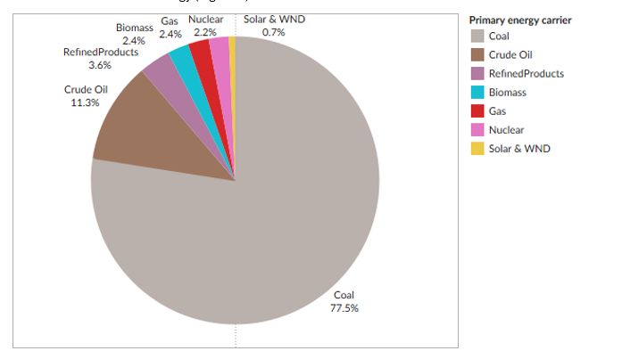
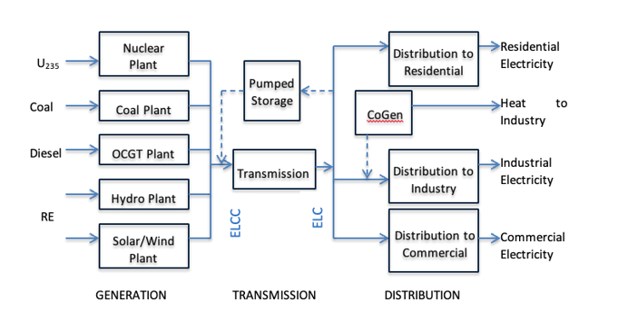

# 4 Energy supply

Energy supply in SATIM is modelled from primary energy sourcing and extraction (e.g. coal mining) through conversion technologies (e.g. power plants and liquid fuels refineries) into secondary energy carriers (e.g. electricity, petroleum, diesel, etc.) that are then transported (or transmitted) and distributed to energy demand sectors and down to energy end-uses (as described in the previous section).

This section focuses on the energy supply sectors of SATIM, including primary energy extraction and import as well as secondary energy conversion in the electricity and liquid fuels sectors.

## 4.1 Primary energy

Primary energy carriers used in South Africa consist predominantly of coal, biomass and imported crude oil and refined product, with small contributions of natural gas and nuclear fuel and a small but growing share of wind and solar energy (Figure 8).

*Figure 8: Estimated proportions of primary energy supply for South Africa in 2019*

### 4.1.1 Coal

The majority of South Africa’s primary energy is sourced from coal mined in South Africa, which serves three major uses:

- Supply to the existing coal power plant fleet to produce electricity
- Supply to Sasol’s coal-to-liquids value chain for conversion into liquid fuels as well as to fuel the production of petrochemicals and other chemical products (see Appendix B)
- Exports to overseas markets, including Europe and Asia (mainly India)

Coal supply to power stations is modelled in SATIM based on data disaggregated at a level that shows:

- Mines, or group of mines, supplying individual power stations, with estimates of the grade of coal (i.e., calorific value or net heating content of each tonne of coal supplied)
- Tonnage of coal supplied to power stations based on their demand (i.e. how much electricity they are producing, with factors for conversion efficiency and auxiliary power losses)
- Costs drawn from actual data on contracts that exist between suppliers and Eskom, factoring type and length of contracts as well as transport and other costs

This data provides a precise estimate of coal consumption and costs for the power sector. However, additional sundry factors such as inconsistencies with the grade of coal supplied are not captured. Broader assumptions are made regarding the costs, heating grades and quantities of coal supplied to Sasol’s coal-to-liquids (CTL) facilities.

Coal export quantities are modelled exogenously – i.e., fixed export levels are assumed and applied into the modelling analysis, without optimisation – with the future of coal exports dependent on assumptions about commodity prices and future demand for coal, particularly in a world that is aiming to reduce carbon emissions. Currently the existing logistical challenges with coal exports through Richards Bay Coal Terminal are not fully accounted in the CGE model.

### 4.1.2 Renewable energy (incl. bioenergy)

Solar and wind energy are used in SATIM exclusively for power generation. The availability of wind and solar plants follows seasonal and diurnal patterns. This is captured with more or less detail depending on the temporal resolution specified.

Bioenergy is distinguished in SATIM into three different types, with use predominantly in industry and the residential sector:

- Biochar
- Biomass
- Biowood

Biofuels (liquid biomass), such as bioethanol and biodiesel, are not currently included in SATIM model analysis, however the capability to analyse these fuels is built within the SATIM architecture.

### 4.1.3 Natural gas

The natural gas sector in SATIM comprises of indigenous supply/ extraction, imports, transformation, transmission and distribution, and final consumption demand. Here, ‘gas’ is both methane rich gas, produced by Sasol, and natural gas (not LPG). Natural gas is supplied via pipeline or LNG terminal to the gas network (transmission and distribution) for distribution. Gas sources in the model currently include:

- Southern Mozambique via existing pipeline
- Coastal gas supplied by LNG
- Indigenous Gas (Ibhubezi)

Natural gas is also supplied to gas power plants and other sectors, namely refineries/chemicals, industry, commercial and residential.

Gas is used in these sectors for energy demand or transformation. Where natural gas is a commodity input as a feedstock, it is classified under ‘transformation’. For example, natural gas is ‘transformed’ in gas power plants to the commodity output electricity. And where gas is utilised for energy or heating it is classified under ‘demand’. For example, gas boilers in the residential and commercial sectors are supplied gas from the gas network for end use heating/energy requirements.

Sasol utilises natural gas as a feedstock. And in its production of synthetic fuel and chemicals it produces methane rich gas which is supplied to industry via gas infrastructure/network.

Gas could be used more extensively in the different sectors (for example as a substitute for coal in industry for process-heating); however, this depends on gas infrastructure being further developed in South Africa.

### 4.1.4 Imports

South Africa imports the majority of its liquid fuels for domestic consumption, both in the form of crude oil for domestic refineries, as well as (increasingly) in the form of refined product such as petrol and diesel. The only domestic primary energy source of liquid fuels is from coal, via Sasol’s CTL facilities.

Liquid fuel imports are sensitive to the availability and operation of domestic crude oil refinery capacity, which is expected to be phased out completely by 2034 (currently Astron’s Cape Town refinery is the only coastal crude oil refinery in operation in the country), as well as the availability of CTL capacity and production. The balance of refined product demand that cannot be met from crude oil, CTL or GTL (gas-to-liquids) refineries has to be imported.

The long-term future of liquid fuels imports is highly sensitive to assumptions about the future transport sector (including the extent to which electric and hydrogen vehicles replace conventional ICEs), which in turn are sensitive to future projections about international fuel prices (see the section on Assumptions below).

## 4.2 Energy carriers

Primary energy inputs as described above are converted into secondary and final energy (‘usable’ energy), predominantly in of two forms: electricity and liquid fuels.

### 4.2.1 Electricity

The power sector is structured in SATIM in three components: Generation, Transmission and Distribution, as illustrated in Figure 9. SATIM is currently configured as a single node model (as per IRP 2023).

*Figure 9: Simplified schematic of the power sector as modelled in SATIM*

**Generation ‘technologies’** in SATIM are modelled in two ways:

- Existing technologies: This comprises all generation plant (>1 MW) operational as of 2012, including the coal PF power fleet (excluding Medupi and Kusile), Koeberg nuclear power station, open-cycle gas turbines (running off diesel), pumped storage facilities, and the small contributions from industrial embedded coal generation as well as hydro. Each large power plant is modelled separately with its own availability and retirement profile. Cahora Bassa is included as existing import.
- ‘New’ technologies: This comprises actual build since 2012 – i.e. Medupi, Kusile, additional OCGT and pumped storage capacity, and initial rollout of utility renewable IPPs – as well as new-build technology options for future generation development. The latter comprises general technology data and applies to both grid and on-site technology options.

Generation technologies are characterised and governed by a range of key data, including:

- **Conversion efficiency** (i.e., the amount of energy a power plant can produce relative to primary energy input, e.g. typically around 35% for coal power stations)
- **Fixed costs**, including capital costs (‘CAPEX’, specified as an ‘overnight’ cost in ZAR per kW capacity) and fixed operational & maintenance (**O&M**) costs.
- **Variable costs**, including fuel costs (which vary by plant, based e.g. on specific coal contract data for Eskom’s coal fleet) and variable O&M costs.
- **Lead time** for plant construction (i.e. estimate number of years for construction up to the point of commercial operation). This is used by the model to calculate the interest during construction (assuming the global discount rate).
- **Economic life** – number of years for which the plant can operate.
- **Availability** – i.e. proportion of the year for which the plant is available for generation (i.e. not shut down for maintenance or forced outages). For RE plants the availability follows seasonal and diurnal patterns. This is captured with more or less detail depending on the temporal resolution specified. Availability of RE plants for new plants built between 2025 and 2032 is set lower than what could be achieved, to capture the current bottlenecks in the transmission infrastructure.
- **Emissions factors** by emission species, including greenhouse gases (CO2, CH4, etc.) and air pollutants (SOx, NOx, and particulate matter).
- **First Year and Maximum Build Rate –** “First Year” takes account of lead times to determine when the earliest year a particular option can become available. Maximum build rate is specified using a growth limit, which is a scenario parameter.

New build options (beyond committed builds) include conventional nuclear, wind, solar PV (grid and rooftop), solar thermal plants, coal, diesel and gas, hydro, imports (including INGA and other potential imports from the Southern African Power Pool), pumped storage and battery technologies.

A **reserve margin** on centrally produced electricity is specified exogenously as a constraint, as follows:

Where CCi = Capacity Credit of grid-based electricity generation technology _i_ and RM is the exogenously specified reserve Margin. In SATIM solar PV, solar thermal plants without storage and wind are by default conservatively assumed to be unable to contribute to the reserve margin (i.e. CC = 0).

For utility-scale grid connected generation, since the country is modelled as a single node, **transmission is modelled as a single technology** linking centralised/high voltage electricity (ELCC) to medium voltage levels (ELC). The **medium voltage electricity is distributed** to each sector using a different technology to capture the different losses incurred in the different sectors. Distributed generation is handled separately and is a relatively new feature that has been added to SATIM to capture the emerging off-grid market – see Section 5.2 below.

### 4.2.2 Liquid fuels

The liquid fuels/refineries sector comprises of crude refineries, Sasol CTL, PetroSA GTL (gas-to-liquids), imports and exports. The refineries sector is represented in SATIM by process technologies specific to each refinery.

Fuel from crude oil and coal is modelled with commodity inputs, outputs, conversion data, and cost data for the different refineries in operation. Refineries (i.e. ENREF, SAPREF and PetroSA GTL) which have recently closed, are ‘switched off’ in the model. Furthermore, new inland and coastal plants, each with associated inputs and costs, can be selected by the model based on overall SATIMGE computation demands and constraints. Supply sector commodities are split into coastal and inland.

Green jet fuel is a recent addition to the refineries sector.

Table 3: Fuels from Refineries, GTL and CTL

| Crude Refineries and GTL | CTL |
| --- | --- |
| AvGas | Avgas |
| Diesel | Diesel |
| HFO | Methane Rich Gas |
| Kerosene/jet fuel/paraffin | Kerosene/Jet Fuel/paraffin |
| LPG | LPG |
| Gasoline | Gasoline/Petrol |
| Other non-energy | Non energy (alcohols) |

**Demand vs supply**

Liquid fuel is imported to balance and meet national liquid fuel requirements above what can be supplied by local refineries. Liquid fuel demand is also met by increased imports when refineries are shut down/ decommissioned in SATIM. Liquid fuels traded include Aviation gasoline (Avgas), diesel and petrol (gasoline).
